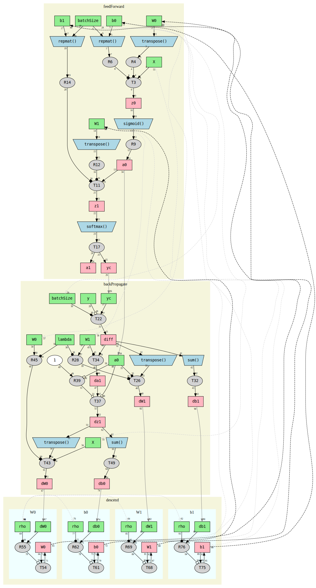

MOPAL
=====

Introduction
------------

MOPAL stands for Matrix-Oriented Pseudo-Assembly Language.

The idea is to express a matrix-oriented computation in
[_GNU Octave_](http://www.gnu.org/software/octave/), as if it were
some two-register assembly language, using _Octave_'s “operator
equals” syntax, which _MATLAB_ lacks, the _C_-like operators `+=`,
`-=`, `*=`, `/=`, `.*=`, and, of course, `=` itself.

Importantly, the _MOPAL_ “source code” is perfectly valid runnable
_Octave_ and may produce the correct result, although it need not do
so. The _MOPAL_ parts of the source appear between the _MOPAL_ start
and end tags:

    % -mopal-start-Foo
    
    T  = B
    R  = transpose(C)
    T += R
    A  = T
    
    % -mopal-end-Foo

You can have anything you like before the start tag for setup (or
after the end tag for whatever reason you like).

An _Octave file_ in this form can then be processed by
[`mopal2dot`](mopal2dot), which emits a
[DOT](http://www.graphviz.org/doc/info/lang.html) language dependency
graph, which is intended to be piped through
[dot](http://www.graphviz.org/cgi-bin/man?dot) to render the
dependency graph as _SVG_, _PDF_ or whatever other output formats
`dot` supports:

    $ mopal2dot -l sample.m | dot -Tsvg > sample.svg

The [sample file](sample.m) is a training algorithm for a two-layer
neural network, provided to me as _C++_ using
[Armadillo](http://arma.sourceforge.net/), which was easily translated
into _MOPAL_, and produces the [sample graph](sample.svg):

Graph Explanation
-----------------

**Pale beige boxes** represent “groups”, delineated by
  `-mopal-group-Foo` and `-mopal-end-Foo`, with “Foo” being used as
  the title for the box. Groups only really affect the determination
  of whether a variable is considered “written”. They have whatever
  semantic meaning you decide. In the sample program, they represent
  phases of one iteration of the neural network training loop.

**Rectangles** represent variables. Variables are colored in each
group without regard to other groups. Those that are only read-from in
a group are colored **green**, while those that are written-to are
colored _red_ (really light **pink**). Variables are connected to
previous groups via grey arrows, explained below.

**Grey ellipses** represent the “registers” `R` and `T`. They are
numbered with their _MOPAL_ line numbers (starting at `1` with
`-mopal-start-*`).

**White ellipses** represent literals (e.g. `1`).

**Blue trapezoids** represent functions.

**Solid black arrows** indicate true dependencies: some kind of direct
assignment. The meanings of the different arrowheads are explained
below.

**Dashed black arrows** (if any) only appear if `mopal2dot` is given
the `-l` (for “loop”) option, and connect the last write of a variable
to its first read over the whole source file, which would indicate a
dependency if the _MOPAL_ source represents one iteration of a loop
(as is the case in the [sample file](sample.m)).

**Grey arrows** are intended to represent “weaker” inferred or likely
dependencies.

**Solid dark grey arrows** connect variables between groups. They are
most noticeable at the beginning of a group entering a green box,
which says, “this variable might not be written-to in _this_ group,
but it was written-to earlier: follow this arrow backwards and you'll
find where it is.”

**Dashed light grey arrows** also connect variables between groups,
but, unlike solid dark grey arrows, which connect variables to their
previous write, these arrows connect variables to the previous _read_
if any. They are purely informations, indicating a “non-dependency”,
and their feintness is intended to indicate that.

### Black Arrowheads ###

The heads of the arrows indicate the operation:

  * **Ordinary filled arrowhead** — `=` — assignment or function argument
  * **Filled circle** — multiplication — `*=` — mnemonic: we often use
    a dots to represent multiplication
  * **Hollow circle** — element-wise multiplication — `.*=`
  * **Filled square** — addition — `+=` — mnemonic: a `+`-sign is
    sort-of “square”, right?
  * **Hollow square** — subtraction — `-=`
  * **Filled diamond** — division — `/=`— mnemonic: alliteration “**d**iamonds do **d**ivision”
  * **Hollow diamond** — element-wise division `./=`

Both ends of an arrow are annotated with the line-number of the operation.

Note the following:

  * “Fancy” arrowhead shapes can only ever appear on a grey bubble (“register”),
    a consequency of the rule that the left-hand side of an operation
    (other than ordinary assignment) must be a “register”.
  * There is _at most one_ ordinary arrow entering every rectangle (variable)
  * There is _exactly one_ ordinary arrow entering every grey bubble (“register”)

MOPAL Details
-------------

### Syntax Rules ###

There are exactly two special variables, analagous to registers, `R`
and `T`, which are completely interchangeable.

There are _exactly four_ valid kinds of line:

  1. `R = variable` — assignment of variable to register
  2. `variable = R`— assignment of register to variable
  3. `R op= T` — assignment of operation result, with argument `T`, to `R` 
  4. `R = function(...)` — assignment of function-call result to register

Note the absence of:

  * `variable = function(...)` — assignment of function call result to variable
  * `variable op= R` — assignment of operation result to variable
  * `R op= function()` — combination of function call and operation

So, what might be expressed as `A = B + C';` in _MATLAB_ or _Octave_ is:

    T  = B            ;
    R  = transpose(C) ;
    T += R            ;
    A  = T            ;

These rules make _MOPAL_ very assembly-language like and, more
importantly, largely trivial to translate into _DOT_.

### Tags ###

`mopal2dot` only really recognizes three tags:

  * `-mopal-start-[label]` — beginning of _MOPAL_ statements
  * `-mopal-group-[label]` — beginning of a _MOPAL_ group
  * `-mopal-end-[label]` — end of _MOPAL_ statements or group

The labels are just passed through to `dot` as titles. They have no
significance to `mopal2dot`. In particular, the label on `-mopal-end-`
is not used.

A `-mopal-end-` ends the last group or the MOPAL statements as a whole.

So What?
--------

### So, what has this to do with matrices? ###

Nothing really, at the moment. The idea of it being runnable _Octave_,
however, means:

  * That the code _must_ be at least dimensionally correct: if your
    _Octave_ program runs to completion without error, the matrix
    dimensions of your operations are, at least, correct (assuming all
    your variables aren't scalars!).
  
  * That the code _may_ actually _be_ correct: if your _Octave_
    program produces the correct results, then the graph represents a
    correct implementation of your algorithm of interest, it is not
    just a “toy” where you have to wonder whether the graph really
    represents your code or you've made some mistake in translation.

#### Enhancements ####

First, it would be easy to getting `mopal2dot` to append `size(R)` or
`size(T)` to every statement, run it, and extract the result (largely
trivial). This could enable the boxes to indicate matrix size or
dimensions, giving an indication of computational significance.

Second, regarding starting matrix dimensions as “size parameters”, we
could assign different prime numbers to them, run the code, and
collect size information for every statement (as in 1.). This would
enable the determination of the number (in principle) of
floating-point and memory operations required for each statement _as a
function of the size parameter_, and thus for the input code as a
whole.

The idea of substituting prime numbers for actual numbers is two-fold:

  1. It may reduce runtime: the code might normally run with
     20,000×20,000 matrices and run for two hours, but who wants to
     wait that long for a _graph_?

  2. It eliminates (or, at least, greatly reduces the likelihood of)
     coincidences in matrix dimensions leading to erroneous
     conclusions: a `f(10,10)` returns a 100-element vector, but is
     that the product of the arguments? `f(3,7)` tells a different
     story if the result has 30, 70, or 21 elements.

### So, no loops? ###

No, not yet, although I don't think support for simple loops would be
difficult to add.

For computational purposes, we're mostly interested in “inner loops”
anyway, so adding _actual_ loops might not add much. It is essentially
useless for the sample file, for example.

### So, groups within groups? ###

I didn't consider that originally, so I went back and hacked-in
alternating background colors for the groups.

It “works” in some sense, but starts a completely new group context
without regard to nesting. In most cases, that messes with the layout,
and I think it would take some fiddling with `dot` weights to get it
to work out nicely in general.

I'm also not sure how it might affect the interpretation.

In the sample file, I'm cheating by putting groups where I did: it
makes it look like group nesting is supported, when it isn't really.
